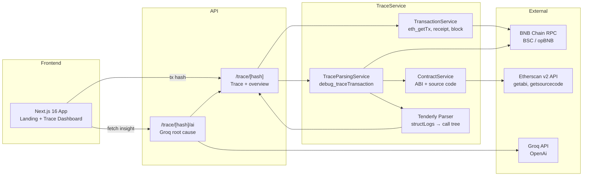

# ClawTrace – AI-Powered Transaction Debugger for BNB Chain

ClawTrace turns BNB Chain transaction debugging into a one-step flow: paste a tx hash, get a Tenderly-style execution trace plus AI root cause analysis in seconds. The project targets the **Builders** track at [Good Vibes Only: OpenClaw Edition](https://dorahacks.io). See [AI_BUILD_LOG.md](AI_BUILD_LOG.md) for how AI was used in development.

---

## 📌 Project Summary

ClawTrace is an open-source transaction debugger for BNB Chain. Developers paste a tx hash, and the app fetches the transaction, runs `debug_traceTransaction` via RPC, fetches contract ABIs from Etherscan, parses structLogs into a Tenderly-like format, and optionally sends trace data to Groq for AI root cause analysis and fix suggestions.

---

## 🧠 Problem & Why It Matters

- **Debugging is slow** – Developers lose hours reading raw structLogs, inferring call boundaries, and manually mapping storage changes.
- **Limited BNB Chain tooling** – Tenderly and similar tools have limited or paid support for BSC and opBNB.
- **No AI-assisted analysis** – Root cause and fix suggestions usually require manual investigation.

Why BNB Chain? High volume, low fees, and a growing DeFi ecosystem mean more developers need fast, reliable tx debugging without vendor lock-in.

---

## 💡 Solution Overview

ClawTrace fetches tx data, structLogs, and contract ABIs; parses them into a readable trace; and offers optional AI-powered root cause analysis.

**Key features**

- Tenderly-style execution trace (call tree, SLOAD/SSTORE, decoded inputs)
- AI root cause analysis (Groq + OpenAi) with fix suggestions and code context
- Etherscan v2 API for ABI/source (supports BSC & opBNB via `chainid`)
- In-memory caching for ABI and tx data
- Flash loan mock on BSC Testnet for reproducible failing txs

---

## 🏗️ Architecture Diagram



---

## 🛠 Tech Stack

| Layer | Tech |
| --- | --- |
| Frontend | Next.js 16 (App Router), React 19, Tailwind CSS 4, Lucide |
| Backend | Next.js API routes, viem (RPC), Groq SDK |
| Trace | Custom parser (structLogs → Tenderly format), ABI decoder |
| Contracts | Foundry, Solidity ^0.8.20, MockToken, FlashLoanPool, FlashLoanBorrower |
| Infra | BNB Chain RPC, Etherscan v2 API, Groq API |

---

## 🔗 BNB Chain Integrations

- **JSON-RPC** – `eth_getTransactionByHash`, `eth_getTransactionReceipt`, `eth_getBlock`, `debug_traceTransaction` for full execution trace.
- **Etherscan v2 API** – Unified `api.etherscan.io/v2/api?chainid=97` for ABI and source code (verified contracts).
- **Wallet-agnostic** – No wallet connection; users only paste a tx hash.
- **Chain support** – BSC Mainnet (56), BSC Testnet (97), opBNB via `CHAIN_ID`.

---

## 📂 Repository Structure

```
clawtrace/
├── src/
│   ├── app/
│   │   ├── page.tsx              # Landing + tx hash input
│   │   ├── trace/[hash]/         # Trace dashboard
│   │   └── api/trace/
│   │       ├── route.ts          # Trace redirect
│   │       └── [hash]/ai/        # AI insight endpoint
│   ├── lib/
│   │   ├── trace/                # Parser, Tenderly format, services
│   │   │   ├── tenderly-parser.ts
│   │   │   ├── trace-service.ts
│   │   │   └── services/
│   │   ├── ai/                   # Groq, prompt building
│   │   ├── etherscan/            # ABI & source client
│   │   └── rpc/                  # viem RPC client
│   └── components/
├── contracts/                     # Flash loan mock (Foundry)
│   ├── src/
│   ├── script/
│   ├── scripts/                  # test-flashloan-onchain.sh
│   └── README.md
├── .env.example
├── AI_BUILD_LOG.md               # AI usage log (Cursor + Claude)
└── README.md
```

---

## ⚙️ Installation & Setup

### 1. Clone the repo

```bash
git clone https://github.com/garrybad/clawtrace.git
cd clawtrace
```

### 2. Install dependencies

```bash
npm install
```

### 3. Environment variables

Create `.env`:

```env
RPC_URL=https://...
RPC_API_KEY=...
CHAIN_ID=97
ETHERSCAN_API_KEY=...
GROQ_API_KEY=...
```

### 4. Run

```bash
npm run dev
```

Open [http://localhost:3000](http://localhost:3000), paste a tx hash, and view the trace.

### 5. (Optional) Generate failing txs for testing

```bash
cd contracts
./scripts/test-flashloan-onchain.sh
```

See [contracts/README.md](contracts/README.md) for deploy and test flow.

---

## 🔑 Environment Variables

| Variable | Required | Description |
| --- | --- | --- |
| `RPC_URL` | Yes | BNB Chain RPC endpoint |
| `RPC_API_KEY` | Depends | If RPC requires API key |
| `CHAIN_ID` | Yes | 56 (BSC) or 97 (testnet) |
| `ETHERSCAN_API_KEY` | Yes | For ABI/source fetch |
| `GROQ_API_KEY` | For AI | For root cause analysis |

---

## 🧪 Testing

```bash
# Frontend (manual: paste tx hash)
npm run dev

# Contracts (unit tests)
cd contracts
forge build
forge test
```

---

## 🎮 How to Use the App

1. Open ClawTrace and paste a BNB Chain tx hash.
2. Press Enter or click Analyze.
3. View the **trace dashboard**: overview, execution trace (call tree, SLOAD/SSTORE, decoded inputs).
4. Click **Fix with AI** (for reverted txs) or **Explain with AI** (for successful txs) to get Groq analysis and fix suggestions.
5. Use the flash loan mock (`contracts/scripts/test-flashloan-onchain.sh`) to generate reproducible failing txs for testing.

---

## 🌐 Deployment

### Deployed addresses (BSC Testnet)

| Contract | Address |
| --- | --- |
| FlashLoanBorrower | `0xC9E8e68de7ECBFe54C573003e09B945DD7A42018` |
| FlashLoanPool | `0xecce43ad5e2EaDfB3466b83A51514B51e3146797` |
| MockToken | `0xd26fc9f7FeF678C67377d655c2aC26Ae6D5c7683` |

Verified on [testnet.bscscan.com](https://testnet.bscscan.com).

### Demo

- **Live demo**: [Clawtrace](https://clawtrace.vercel.app/)
- **Sample failing tx**: Run `./contracts/scripts/test-flashloan-onchain.sh` to get tx hashes.

---

## 🎥 Demo Assets

- **Live Demo URL**: [Clawtrace](https://clawtrace.vercel.app/)
- **Video Demo**: [Youtube](https://youtu.be/Fd5Gd1eYvGA)
- **AI Build Log**: [AI_BUILD_LOG.md](AI_BUILD_LOG.md) – how AI (Cursor + Claude) was used to build ClawTrace

---

## 🗺 Roadmap

- **Short term** – Support opBNB testnet; improve internal function call detection (JUMPDEST heuristic).
- **Medium term** – Trace comparison (diff two txs); export trace as JSON/PDF.
- **Long term** – Real-time trace streaming; integration with common BNB Chain dev tools.

---

## 🤝 License

MIT

---


## 👥 Team
| Member | Role | Contact |
| --- | --- | --- |
| _demigohu_ | Smart Contracts & Backend | [LinkedIn](https://www.linkedin.com/in/tegaraji/) [Twitter/X](https://x.com/demigohu) |
| _garrybad_ | Frontend & UX | [LinkedIn](https://www.linkedin.com/in/muhammad-garry/) [Twitter/X](https://x.com/itsktoru) |

---